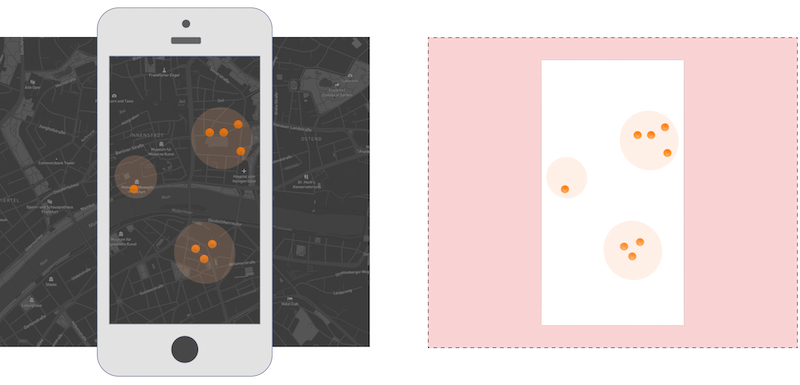

# Layout assets

All layout assets can be found in:

- **/assets/layout/**

These assets are **mandatory** in the app and they can only be replaced with files with the same name and extension.

- :open_file_folder: **icons**
  - arrow.svg - _breadcrumb arrow used in menu_
  - close.svg - _generic close button icon_
  - info.svg - _generic info/help button icon_
  - explore.svg - _main nav explore tab icon_
  - list.svg - _main nav list tab icon_
  - menu.svg - _main nav menu tab icon_
  - qr.svg - _main nav Qr tab icon_
- app-logo.svg - _app in page logo_
- map-povs.jpg - _POVs static map background_
- map-povs-overlay.png - _POVs static map overlay_
- poi-inview.png - _explore in view overlay effect_

### How to replace POVs static map

The POVs static map is composed of 2 layers:

- Map background (\*.jpg)
- POVS overlay (transparent \*.png)

Both images should have the same size and resolution and should include XY padding to always fit different screen resolutions.

The POVs markers should be center centered and their bounding box should have an aspect ratio of circa 0.52.

The Map background will be automatically tinted/merged with the application background.

### How to replace an SVG icon

To avoid unnecessary style tweaks, we hardly recommend using the same size and format of the given icons.

The app is responsive, therefore the icons should not have set any inline height or width.
