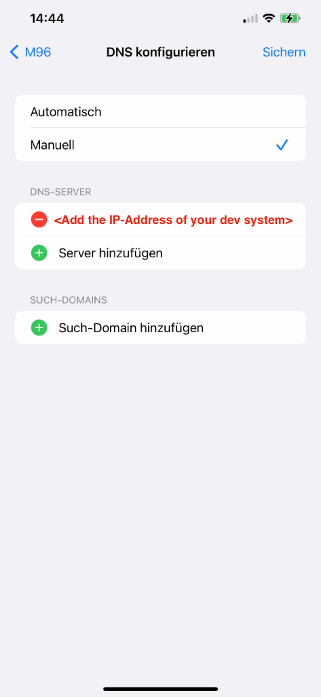

# Create local HTTPS certificates for development

While development you need to use the camera or gps modules of you mobile device. Newer browsers only allow to use this functionalities with HTTPS. The following tutorial allows to setup locally trusted devleopment certificats on a Mac M1 by using [mkcert](https://github.com/FiloSottile/mkcert) and [dnsmasq](https://dnsmasq.org).

## Setup mkcert

Installation on Mac M1 as described on [https://github.com/FiloSottile/mkcert#macos](https://github.com/FiloSottile/mkcert#macos)

```
brew install mkcert
```

> If you use Firefox you need to install further software to allow the certs (see Gitub link above)

### Step 1 – Create local CA

Created a new local CA and install it in the system trust store

```
mkcert -install
```

### Step 2 - Create certificates

Created new certificates for dev.test, \*.dev.test, localhost and loopback address IP4/IP6

```
cd ~/certs
mkcert dev.test '*.dev.test' localhost 127.0.0.1 ::1
```

Result

```sh
dev.test+4-key.pem
dev.test+4.pem
```

### Step 3 - Start the server with the helper script

```sh
./nx.serve.ssl.sh
```

## Install dnsmasq

Use dnsmasq as dns server on your local dev system to resolve the `dev.test` domain.

```
brew install dnsmasq
```

### Step 1 – Configure the DNS entry for your local domain.

```sh
echo 'address=/mylocalmesoapp.test<your-local-ip-address>' > /opt/homebrew/etc/dnsmasq.conf
sudo brew services start dnsmasq
sudo mkdir /etc/resolver
sudo bash -c 'echo "nameserver 127.0.0.1" > /etc/resolver/test'
sudo brew services restart dnsmasq
```

> Every time your local **IP-address** on your dev system **changes** you have to adjust the IP address. in the `/opt/homebrew/etc/dnsmasq.conf` for `address=/.test/<your-local-ip-address>`
>
> Don't forget to restart the service after the IP config change.

### Step 2 – Test the local DNS entry

```sh
dig dev.test @<your-local-ip-address> +short
```

or with

```sh
nslookup dev.test <your-local-ip-address>
```

### Step 3 – Start the server and test the ceritifacte in your Broser

Start the server with the extra startup script to utilize your local certificats.

```sh
./nx.serve.ssl.sh
open https://dev.test:4200/
```

The browser should accept you certificate and open the https URL without any errors.

### Step 4 – Setup iOS-Device

Resolve your dev.test domain with the DNS on your local dev system.

1. On your iOS Device open `System Preferences > WLAN > YOUR WLAN > DNS Configuration`
2. Change the configurtion from `automcatic` to `manual`.
3. Remove all DNS-Server entries and add the IP-address from your local dev system
4. Open https://dev.test:4200 on your iOS device

> Don't forget to role back the manual DNS settings after you finished your development.


