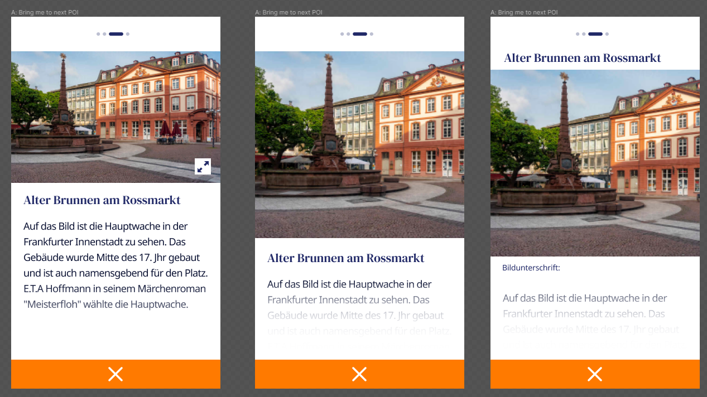

# Markdown

The app is using [markdown-it](https://github.com/markdown-it/markdown-it) as a markdown parser.

Other than the common markdown syntax, it has set up URL auto-linking and allows a more complex layout by using custom containers.

Custom containers, currently are parsed as wrappers DIVs with the relative custom class.

App default custom containers:

- **home** _wrapper around homepage contents_
- **caption** _image caption wrapper_
- **card** _wrapper around POV page contents_
- **slide** _contents splitting into slides (card or page)_
- **background** _extra background element relative to a parent element_
- **app-logo** _page logo wrapper_

The style of these containers can be added/replaced in **assets/styles/markdown.css**.

## Define a container

**Known as code block** [read more](http://spec.commonmark.org/0.25/#fenced-code-blocks)

In this app, a container **code fence** is a sequence of at least three consecutive **colon** characters (:).

eg:

```
::: my-container

  this is my custom container
:::
```

will be parsed into

```
<div class="my-container">
  <p>this is my custom container</p>
</div>
```

The container can contain any inner markdown.

## Nested containers

It is possible to have nested containers eg: card > slide.

In this case, use the same principle as in fenced block for nested things, so add more **:** for the outer block start/end.

```
:::: wrapper-container

# Lorem ipsum h1

::: child-container

## Lorem ipsum h2

Lorem ipsum text
:::
::::
```

will be parsed into

```
<div class="wrapper-container">
  <h1>Lorem ipsum h1</h1>
  <div class="child-container">
    <h2>Lorem ipsum h2</h2>
    <p>Lorem ipsum text</p>
  </div>
</div>
```

### App examples - Slides and POV Card Detail

Any content can possibly be rendered as a slideshow by using the **slide** custom container.

Eg: myfile.md

```
::: slide


# Slide 1

Vivamus suscipit tortor eget felis porttitor volutpat. Sed porttitor lectus nibh.

:::

::: slide


# Slide 2

Nulla quis lorem ut libero malesuada feugiat. Nulla quis lorem ut libero malesuada feugiat.

:::
```

will display a slideshow with 2 slides, as in the case of POV Card Detail example markdown file.



## Extend custom containers

It is possible to add extra containers class names in **/assets/markdown.json**

```
{
  "containers": ["my-custom-container"]
}

```
